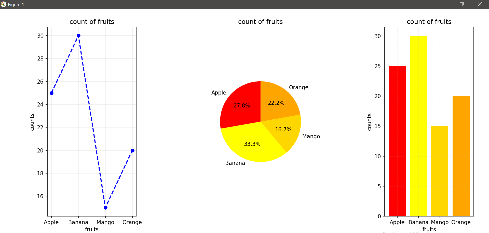

# Python Visualization Lab

This repository is a collection of Python scripts demonstrating various types of data visualizations and interactive data apps. It combines both static visualizations using **Matplotlib** and web-based interactivity using **Streamlit**.

Whether you're learning data visualization, building small apps, or experimenting with Python libraries, this repo provides practical examples of both.

---


## 1. Fruit Count Visualization using Matplotlib

This project demonstrates the use of `matplotlib` to visualize fruit count data using three different types of plots in a single window:

- 📈 Line Plot
- 🥧 Pie Chart
- 📊 Bar Chart

Features
==========
==> Uses subplot(1, 3, i) to arrange 3 plots in a row.

==> Custom colors and styles.

==> Clean grid layout with labeled axes.

📸 Output


🔧 Code File:fruits.py

## 2.Dataset --folder

it contain  hist_boxplot.ipynb and summary 
A Python program using Seaborn and Matplotlib to explore the petal_length feature of the Iris dataset.

🔧 Code File:hist_boxplot.ipynb

## 3. Tips Dataset Visualizer (Streamlit App)

This project includes an interactive Streamlit app (`tips.py`) that visualizes restaurant tipping data from the classic `tips.csv` dataset. The dataset includes features like total bill, tip amount, gender of the customer, day of the week, and more.

---

### 📊 What the App Does

Using **Matplotlib** and **Pandas**, the app displays a 2x2 grid of plots:

| Plot Type           | Description |
|---------------------|-------------|
| 📈 **Histogram**     | Shows the distribution of `total_bill` values |
| 📦 **Boxplot**       | Displays spread and outliers in `tip` amounts |
| 🥧 **Pie Chart**     | Represents the gender distribution (`sex`) |
| 📊 **Bar Chart**     | Compares average `total_bill` by `day` |

---

### 🌐 Interactive Streamlit Features

- 🔄 CSV Upload: Upload your own version of `tips.csv`  
- 🔍 Auto fallback: If no CSV is uploaded, it loads the default `tips.csv`  
- 📐 Dynamic plotting: All visualizations adjust based on uploaded data  

---

### ⚙️ Technologies Used

- **Streamlit** – For building the web interface
- **Matplotlib** – For creating the visualizations
- **Pandas** – For loading and manipulating the CSV
- **Python 3.x**

---

### 🚀 Live Demo

Try it online:  
🔗 [Launch Streamlit App](https://matplotlib-xyn45ayrttylptyvc287rx.streamlit.app/)


---

🔧 Code File:tips.py

```bash
streamlit run tips.py
